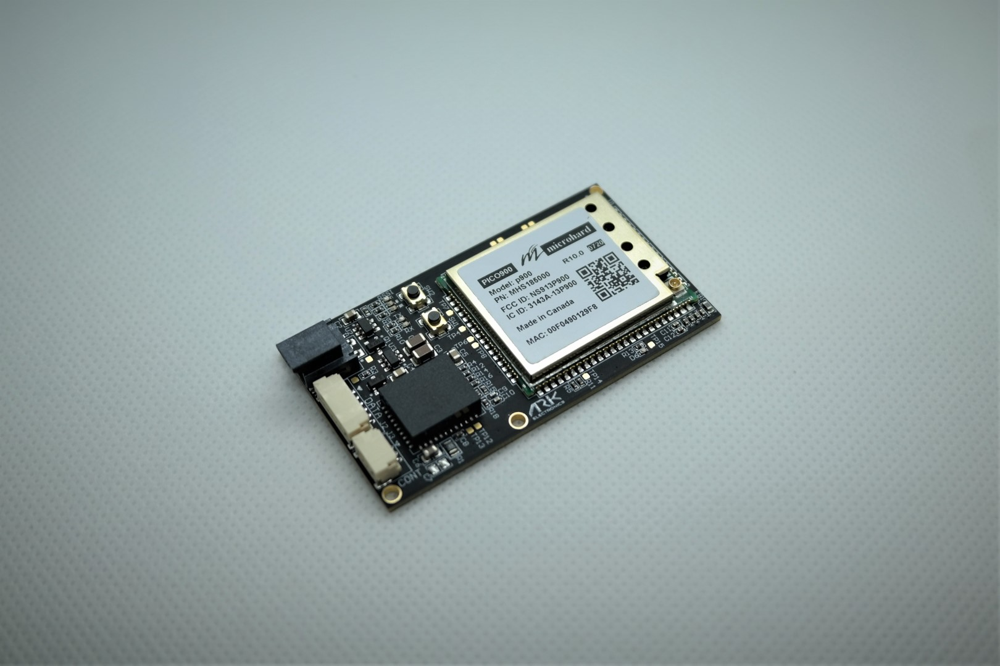

# Microhard Serial Radio

[Microhard Pico Serial](http://microhardcorp.com/P900.php) radios enable MAVLink communication between a radio on a vehicle and a GCS.  
Microhard Pico Serial radios are 1 watt output radios that support point to point, point to multi-point, and mesh modes.
A single ground station radio can be used to communicate with multiple vehicles using point to multi-point or mesh. Vehicles must have different IDs.

## Purchase:

* [1W 900MHz Serial Telemetry Radio](https://arkelectron.com/product/1w-900mhz-serial-telemetry-air-radio/)
* [1W 900MHz USB Serial Telemetry Radio](https://arkelectron.com/product/1w-900mhz-serial-telemetry-ground-radio/)
* [1W 2.4GHz Serial Telemetry Radio](https://arkelectron.com/product/1w-2400mhz-serial-telemetry-radio/)
* [1W 2.4GHz USB Serial Telemetry Radio](https://arkelectron.com/product/1w-2400mhz-usb-serial-telemetry-radio/)